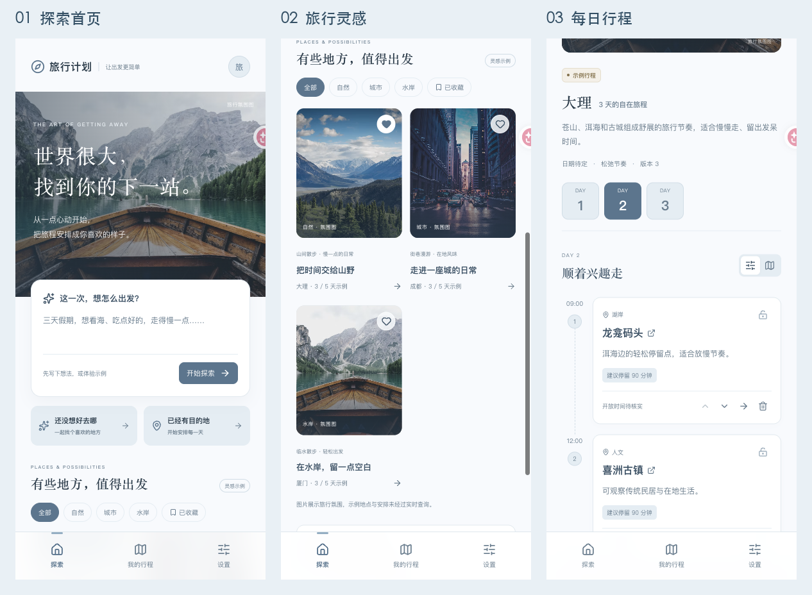

# 旅游产品 v0.3 开发版

手机优先的旅行规划 Web。按 v0.3 PRD 实现真实 AI 的可配置接入层：目的地发现 → 比较 → 地点查询 → 逐日计划 → 修改提案 → 用户确认保存。暂缓正式命名。

## 界面预览



## 当前状态

- 前端和后端已接线；有明确标识的交互示例。
- 尚未提供模型／高德密钥，因此**未通过真实模型和外部资料端到端验收**，也未发布 HTTPS 服务。
- 无配置时返回 503，页面显示服务待配置，不使用样例假冒 AI 结果。
- 默认地点供应商为高德中国大陆服务；全球覆盖尚未实现。
- 图像是 Unsplash 旅行氛围图，不声称为对应城市实拍。底图为 OSM，第三方资源失败会提示。

## 本地启动

需要 Node.js 24（使用原生 TypeScript 类型擦除、SQLite 与 fetch）。

```sh
npm ci
cp .env.example .env
# 填写 .env 中的服务配置后启动；没有密钥也可体验界面和示例
npm run dev
```

前端 http://127.0.0.1:5173 ，API http://127.0.0.1:17887 。一条 dev 命令同时启动两者。终端退出后本地服务停止；这不是线上分享链接。

生产方式：

```sh
npm run build
npm start
```

生产 API 同时提供 dist 静态文件，访问 http://127.0.0.1:17887 。数据库保存在 data/travel.sqlite；备份 SQLite 需要一起考虑 WAL，建议停服务后复制数据库或使用 SQLite 在线备份工具。

## 服务配置

全部密钥仅在服务端读取，不使用 VITE_ 环境变量。

| 变量 | 用途 |
|---|---|
| MODEL_BASE_URL | 模型 API 基地址，默认 OpenAI /v1，可改兼容服务；外部地址要求 HTTPS |
| MODEL_API_KEY / MODEL_NAME | 服务密钥与具体模型名称；不默认指定模型 |
| MODEL_PROTOCOL | chat：Chat Completions 工具调用；responses：OpenAI Responses 工具调用 |
| AMAP_WEB_KEY | 高德 Web 服务 Key，需要 POI、地理编码、步行／驾车路线权限 |
| TAVILY_API_KEY | 可选网页检索，缺失时票价／预约／天气保持待核实 |
| AGENT_MAX_STEPS / AGENT_MAX_TOOL_CALLS | 每次最大循环轮数及工具调用数 |
| AGENT_TIMEOUT_MS / AGENT_MAX_OUTPUT_TOKENS | 总时限与单次模型输出 token 上限 |
| MAX_CONCURRENT_RUNS | 单实例并发运行数，默认 2 |
| APP_ORIGIN / COOKIE_SECURE | HTTPS 部署的外部来源及 Secure cookie |

聊天协议发出 max_completion_tokens；兼容服务必须支持工具调用与该参数。Responses 适配不启用 reasoning 模式参数，未核验各型号兼容性，配置后需进行实际服务测试。主模型、工具上限与费用单价尚需用试点结果评估。系统记录 token 数量，不把 token 当成已计算的人民币费用。

## 代码与架构

- shared/schema.ts：严格的领域数据契约。
- server/agent.mjs：单 Agent loop、6 个模型可见工具、权限检查、工具前后进度、旧结果压缩、完成校验。
- server/providers.mjs：chat/responses 模型适配、高德地点／事实／路线查询及可选 Tavily。
- server/validation.mjs：地点证据、天数、重复、时间／交通、锁定安排和局部修改范围校验。
- server/repository.mjs：SQLite 存储、事务版本更新、提案确认、撤销快照。
- server/index.mjs：匿名会话归属、请求来源检查、参数验证、幂等、异步队列、取消、超时、重启恢复。
- src/App.tsx：手机双入口、需求采集、候选比较、进度／澄清、提案预览、行程管理和设置。
- src/TripMap.tsx：真实地点底图、GCJ02 到 WGS84 显示转换；线路仍使用供应商坐标。点间连线是顺序，不是导航。

第 7 个动作 apply_confirmed_patch 由产品 API 实现，不暴露给模型。工具只读取资料及生成提案，模型不能执行交易、shell 或直接修改已保存行程。

## 数据与运行边界

- 每个匿名会话使用 256 bit HttpOnly / SameSite=Strict cookie。单实例的全局队列与会话上限限制规划频率。
- status：queued → running → ready/ready_partial/needs_input/failed/cancelled；确认应用后 committed。
- 服务重启将中断任务标为 failed，页面可恢复状态并重新发起；**尚未实现恢复到中断工具步骤的续跑**。
- needs_input 可补充三次。runId 与旅程记录持久化；查询轨迹记录阶段／工具名／时间，避免记录密钥或完整模型对话。
- 调整范围由界面明确指定：默认当前日期，可允许整个行程。范围外日期、锁定地点的时间／内容均由代码保护。
- 没有完整费用证据时预算只是偏好；自然语言硬约束、具体日期营业／预约规则仍需人工核验，不能宣称全部已满足。
- 清除记录删除当前会话的 run、trip、snapshot 和本地 v0.3 存储。旧 v0.2 本地 key 不自动删除或迁移。
- 当前为单实例试点，不具备多进程队列、完整账户系统、长期跨旅行记忆及定时提醒。

## 验证

```sh
npm test
npm run lint
npm run build
```

tests 使用隔离的测试模型与资料，不调用收费服务，不进入产品页面；验证循环、越权、幂等、缺配置、证据、锁定、局部范围、确认写入、取消及版本冲突。它们不验证真实资料正确性。

浏览器截图和验收记录位于 artifacts/。实际服务配置后必须再核查两条真实入口、路线数据、调整提案及来源。

## 部署准备

```sh
docker build -t travel-product .
docker run --env-file .env -e HOST=0.0.0.0 -p 17887:17887 -v travel-data:/app/data travel-product
```

Dockerfile 未在当前环境实际构建。上线前配置 HTTPS 反向代理、APP_ORIGIN、COOKIE_SECURE=true、数据库持久化备份、资源访问策略与供应商额度。单实例部署只运行一个进程；多实例前需要共享数据库和作业队列。此文件提供部署准备，不代表已上线。

## UI 参考与接口资料

- Mindtrip Inspiration（实际浏览）：https://mindtrip.ai/inspiration 。参考发现页层级与图片卡片。
- Wanderlog（实际浏览公开规划页）：https://wanderlog.com/plan-a-trip 。参考目的地入口、行程地图的产品组织；未登录其编辑器。
- OpenAI Function Calling：https://developers.openai.com/api/docs/guides/function-calling
- 高德 POI：https://lbs.amap.com/api/webservice/guide/api-advanced/search
- 高德地理编码：https://lbs.amap.com/api/webservice/guide/api/georegeo

本产品的视觉、代码和文案独立实现，没有复制竞品商标或页面素材。


## 2026-09-26 摄影风界面

按用户确认的 Fora 摄影质感、Mindtrip 探索网格、Tripsy 行程卡片独立实现。增加主题筛选和本地收藏，保留双入口与编辑。截图和验收见 artifacts/摄影风界面验收-20260926.md。图片为旅行氛围，依赖 Unsplash；真实 AI 待配置。


## GitHub 项目归档

仓库收录源码、前后端配置、依赖锁文件、测试、截图与验收资料。发行版提供 ZIP 下载，包含相同项目文件及 `dist/` 构建产物。`node_modules/`、本机数据库 `data/`、真实 `.env`、系统缓存与 Git 内部文件不上传；使用 `npm ci` 恢复依赖，服务启动后创建数据库。

默认本机端口为 **17887**；旧 8787 端口已被其他项目使用。真实 AI 与地点查询需配置服务端环境变量。
